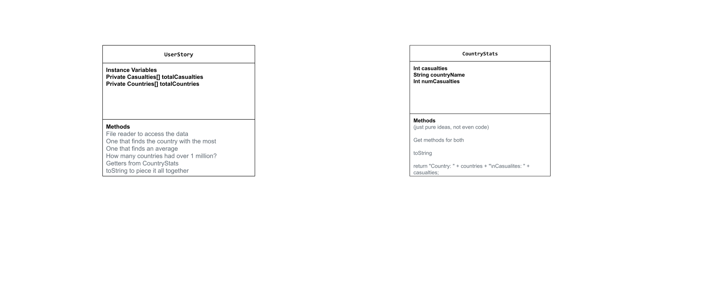

# Unit 3 - Data for Social Good Project

## Introduction

Software engineers develop programs to work with data and provide information to a user. Each user has different needs based on the information they are looking for from data. Your goal is to create a data analysis program for your user that stores and analyzes data to provide the information they need.

## Requirements

Use your knowledge of object-oriented programming, one-dimensional (1D) arrays, and algorithms to create your data analysis program:
- **Write a class** – Write a class to represent your user or business and store and analyze their data with no-argument and parameterized constructors.
- **Create at least two 1D arrays** – Create at least two 1D arrays to store the data that your user needs information about.
- **Write a method** – Write a method that finds or manipulates the elements in a 1D array to provide the information your user needs.
- **Implement a toString() method** – Write a toString() method that returns general information about the data (for example, number of values in the dataset).
- **Document your code** – Use comments to explain the purpose of the methods and code segments and note any preconditions and postconditions.

## User Story 

Include your User Story you analyzed for your project here. Your User Story should have the following format: 

> As world history enjoyers,   
> we want to analyze casualties by country during WW2,   
> so that we can understand the scale of human cost during the war.

## Dataset 

Dataset: https://www.kaggle.com/datasets/notkrishna/world-war-2-causalities-by-country?utm_source=chatgpt.com 
- **Countries** (String) - name of the country 

This was used to help us determine what country each information was portraying.
- **Total Deaths** (int) - number of people in the country 

This was used to answer most, if not all of our questions. Total deaths was important because it's what we based our data project on.

## UML Diagram 

Put an image of your UML Diagram here. Upload the image of your UML Diagram to your repository, then use the Markdown syntax to insert your image here. Make sure your image file name is one work, otherwise it might not properly get displayed on this README. 

 

## Description 

Write a description of your project here. In your description, include as many vocab words from our class to explain your User Story, the chosen dataset and how your project addressed that users goals. If your project used the Scanner class for user input, explain how the user will interact with your project.

As world history enjoyers, we wanted to do something related to world history. As data sets are difficult to find, and not much common interest in anything else, we decided on world war 2. We wanted to put implement data from a ww2 casualties data-set into our comp sci project. Our code stores the important information in arrays that are strings and integers. Both for the countries and the numbers. Getter methods are used, and a file reader enables the information stored to be accessed and used. Now its just for-loops and methods that make calculations such as the average, and country with the most to make function. Lastly a toString sews it all together so we get an output. Our data set really answered our questions: 

- Which country suffered the most casualties?

- What is the average number of casualties across all countries?

- How many countries had casualties above 1,000,000?

This project and data set really helped us understand the scale of human cost during the war. Not just this war, but every war has a cost. We thank the soldiers and veterans that served our contry to protect our freedom.